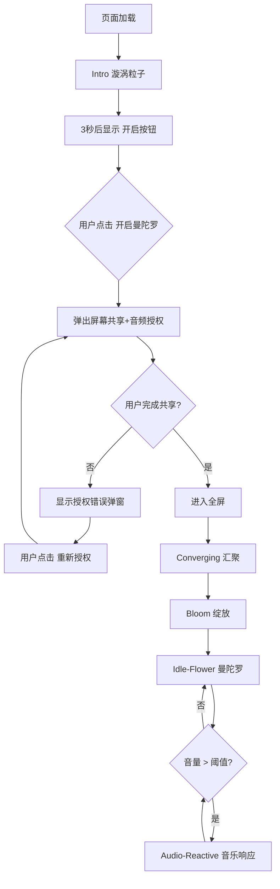

# 曼陀罗音频沉浸空间 - 产品需求文档（PRD）

## 文档信息

| 项目 | 内容 |
|------|------|
| 文档名称 | 曼陀罗音频沉浸空间 PRD |
| 产品名称 | Audio-Reactive Mandala |
| 版本 | v1.0 |
| 更新日期 | 2025-02 |
| 技术栈 | p5.js + 原生 HTML/JS |

---

## 一、问题与背景

### 1.1 业务目标
打造一款**音乐可视化沉浸体验产品**，用户通过授权系统音频后，曼陀罗粒子随音乐节奏、频谱实时变化，形成听觉与视觉的联动，提供放松、冥想或背景展示场景。

### 1.2 核心用户诉求
- 低门槛：点击即可进入，无需安装
- 沉浸感：全屏、无明显 UI 干扰
- 响应性：粒子与音乐同步，无明显延迟或卡顿
- 美学：曼陀罗形态、色彩渐变、纵深感

### 1.3 技术约束
- 需用户授权**屏幕共享 + 系统音频**（Chrome/Edge getDisplayMedia）
- 纯前端，无后端服务
- 需兼顾低端设备性能

---

## 二、目标与成功指标

| 指标 | 目标 |
|------|------|
| 帧率 | 稳定 60fps（或设备可承受最佳帧率） |
| 音乐响应 | 无明显「一卡一卡」感，粒子跟拍流畅 |
| 授权成功率 | 清晰的步骤引导，降低用户放弃率 |
| 视觉一致性 | 玻璃拟态、中英双语、统一字体 |

---

## 三、代码架构与层次划分

### 3.1 整体分层

```
┌─────────────────────────────────────────────────────────────┐
│  UI 层（index.html）                                          │
│  - 开场按钮、授权弹窗、状态栏、请播放音乐、沉浸式按钮               │
├─────────────────────────────────────────────────────────────┤
│  逻辑层（sketch.js）                                          │
│  - 模式状态机（intro → converging → idle-flower/audio-reactive）│
│  - 音频检测、频谱提取、EMA 平滑                                 │
│  - 授权流程、全屏控制                                          │
├─────────────────────────────────────────────────────────────┤
│  粒子与渲染层（sketch.js）                                      │
│  - Particle 类：力场、物理、绘制                                │
│  - 中心核、鼓点波纹、背景渐变                                    │
└─────────────────────────────────────────────────────────────┘
```

### 3.2 核心文件与职责

| 文件 | 行数 | 职责 |
|------|------|------|
| `index.html` | ~260 | 布局、样式、UI 节点、字体 |
| `sketch.js` | ~1235 | 全部逻辑与渲染 |

### 3.3 关键代码索引

| 功能 | 文件 | 行号范围 |
|------|------|----------|
| 错误提示配置（中英双语） | sketch.js | 6–35 |
| 全局状态、配置 | sketch.js | 37–93 |
| Particle 类（力场、物理、绘制） | sketch.js | 95–518 |
| getLayerShape（四层花瓣形态） | sketch.js | 519–557 |
| setup（初始化、粒子创建、层级） | sketch.js | 559–648 |
| draw（主循环、模式分支、粒子更新） | sketch.js | 650–932 |
| requestScreenCaptureAndSetupAudio | sketch.js | 945–932 |
| startExperience / retryAudioCapture | sketch.js | 934–982 |
| startAudioDetection（频谱、EMA、kick） | sketch.js | 984–1094 |
| showAudioError（授权弹窗 2×2 步骤） | sketch.js | 1151–1212 |
| 授权弹窗样式、按钮样式 | index.html | 116–221 |

---

## 四、交互流程与跳转

### 4.1 主流程



### 4.2 模式状态机

| 模式 | 触发条件 | 粒子行为 |
|------|----------|----------|
| `intro` | 初始 | 漩涡汇聚 + 噪点飘动 |
| `converging` | 点击开启 → 授权成功 | 1.5s 汇聚到中心，1s 绽放到曼陀罗 |
| `idle-flower` | 绽放完成 或 音量低 | 六瓣花，正弦呼吸 |
| `audio-reactive` | 音量 > 阈值 | 随 bass/mid/treble 缩放、谐波、颜色 |

### 4.3 关键跳转说明

| 跳转 | 实现方式 |
|------|----------|
| Intro → Converging | `startExperience()`：清空 overlay，设置 `currentMode='converging'`，调用 `requestScreenCaptureAndSetupAudio()` |
| 授权成功 | `requestScreenCaptureAndSetupAudio()` resolve → `document.documentElement.requestFullscreen()` |
| 授权失败 | catch → `showAudioError(config)`，显示 2×2 步骤 + 重新授权 |
| 重新授权成功 | `retryAudioCapture()` 内同样进入全屏 |
| Converging → Idle | `convergeToMandalaBlend >= 1` → `currentMode='idle-flower'` |
| Idle ⇄ Audio | 由 `startAudioDetection` 内根据 `volume > AUDIO_THRESHOLD` 切换 `particleMode` |

### 4.4 UI 显隐逻辑

| UI 元素 | 显示条件 | 隐藏条件 |
|---------|----------|----------|
| 开场按钮 | 3 秒后 | 点击开启后清空 overlay |
| 请播放音乐 | 曼陀罗模式 + 音量=0 + 从未检测到音乐 | 播放音乐后 `hasAudioTrack=true` |
| 授权错误弹窗 | 授权失败 | 重新授权成功 |
| 沉浸式按钮 | `idle-flower` 或 `audio-reactive` | 其他模式 |
| 状态栏 | 有音频后 | 初始 |

---

## 五、功能清单

### 5.1 必须功能（Must）

| 功能 | 说明 |
|------|------|
| 屏幕+音频授权 | getDisplayMedia，支持首次授权与重新授权 |
| 粒子曼陀罗 | 4 层花瓣，不同瓣数/半径/形态 |
| 音乐响应 | bass/mid/treble 驱动缩放、谐波、颜色、层级生长 |
| 鼓点脉冲 | kick 检测 → 圆环波纹 + 粒子径向斥力 |
| 全屏 | 授权成功后自动全屏，曼陀罗内可手动切换 |
| 中英双语 UI | 开场、授权、错误提示 |

### 5.2 可选增强（Should）

| 功能 | 说明 |
|------|------|
| 沉浸式按钮 | 曼陀罗右下角，玻璃拟态，切换全屏 |
| 层级生长 | 随音量/鼓点/时间逐层激活 |
| 粒子从外飞入 | 新层激活时粒子从屏幕外被拉回 |

---

## 六、重要优化迭代记录

### 6.1 粒子与音乐响应

| 迭代 | 变更 | 目的 |
|------|------|------|
| 1 | `breathScale`: 0.5→0.18，`petalWidth`: 0.9+0.2*mid→0.95+0.06*mid | 降低膨胀幅度，减少左右波动 |
| 2 | `harmonicRadius`: 0.25→0.06 | 降低谐波幅度，减轻卡顿与乱飞 |
| 3 | `dt` 上限: 1.5→1.2 | 掉帧时物理步长更保守 |
| 4 | 频谱 EMA 平滑（SMOOTH=0.4） | 消除粒子随音乐「一卡一卡」 |
| 5 | `analyser.smoothingTimeConstant`: 0.3→0.55 | 频谱更平滑 |
| 6 | 音频检测: 33ms→20ms（50fps） | 音乐响应更跟拍 |
| 7 | `audioReactiveBlend` lerp: 0.06→0.1 | 音乐模式下响应更快 |
| 8 | `globalScale` lerp: 0.05→0.08 | 全局缩放更跟鼓点 |

### 6.2 纵深感

| 迭代 | 变更 | 目的 |
|------|------|------|
| 1 | `brightnessOffsetInLayer`: 78–92 → 65–95 | 内层暗、外层亮 |
| 2 | 瓣缘亮度: `(1-radiusRatio)*6` → `radiusRatio*12` | 花瓣外缘更亮 |
| 3 | 粒子透明度: `layerAlphaMult = 0.65 + targetLayer*0.12` | 内层半透明、外层更实 |

### 6.3 粒子出生逻辑

| 迭代 | 变更 | 目的 |
|------|------|------|
| 1 | 新层激活时，粒子在屏幕外圈出生（`diag*1.15`） | 从外向内飞入 |
| 2 | 飞入过程 alpha：`approachFactor = 1 - dist/380` | 由暗到亮过渡 |

### 6.4 性能与卡顿

| 迭代 | 变更 | 目的 |
|------|------|------|
| 1 | 粒子数: 26000→20000（4500+5500+5500+4500） | 减轻主循环负担 |
| 2 | 中心核: 2000+500→1500+400 | 降低中心核开销 |
| 3 | noise 交错: 4 帧→6 帧 | 减少约 33% noise 调用 |
| 4 | 跳过 `targetLayer > maxActiveLayer` 粒子 | 未开放层不计算（注意：需保留可能被激活的粒子） |
| 5 | 跳过 `currentAlpha < 8` 的绘制 | 极暗粒子不绘制 |
| 6 | 脉冲力场: 仅对波带内粒子计算（`_pulseZoneMin/Max`） | 鼓点+四层时显著减负 |
| 7 | `pulseWaves` 最多 4 个 | 限制波纹数量 |
| 8 | 背景渐变缓存 | 避免每帧创建 gradient |
| 9 | 沉浸按钮: 仅模式切换时更新 DOM | 避免每帧 getElementById/classList |

### 6.5 全屏与沉浸

| 迭代 | 变更 | 目的 |
|------|------|------|
| 1 | 共享完成后进入全屏（非点击即全屏） | 先完成授权再全屏 |
| 2 | 重新授权成功后同样进入全屏 | 统一体验 |
| 3 | 曼陀罗右下角沉浸式按钮 | 可随时切换全屏 |

### 6.6 UI 与授权

| 迭代 | 变更 | 目的 |
|------|------|------|
| 1 | 授权弹窗步骤 2×2 网格，数字圆形框 | 结构清晰 |
| 2 | 步骤 3 中英文同色（#ffd899） | 强调勾选共享音频 |
| 3 | 数字与中英文平衡线对齐（`align-items: center`） | 视觉协调 |

---

## 七、遇到的困难

| 困难 | 表现 | 解决方式 |
|------|------|----------|
| 其他层粒子不工作 | 跳过 `!isActivated` 时，applyAudioReactiveForces 未被调用，粒子无法激活 | 仅跳过 `targetLayer > maxActiveLayer`，保留可被激活粒子的处理 |
| 粒子从屏幕外飞入 | 最初在屏幕内或边缘出生，观感不符 | 出生半径使用 `diag*1.15`，确保在可见区域外 |
| 音乐响应「一卡一卡」 | 频谱 33ms 更新，每 2 帧跳变 | EMA 平滑 + 50fps 检测 + analyser 平滑 |
| 鼓点+四层同时卡顿 | 脉冲力场对全部粒子计算 | 预计算波带范围，波带外粒子跳过 |
| 授权弹窗观感 | 步骤、数字、颜色需统一 | 圆形数字框、平衡线对齐、步骤 3 高亮 |

---

## 八、可迭代方向

| 方向 | 说明 |
|------|------|
| WebGL 渲染 | 使用 p5.WebGL 或原生 WebGL 批量化绘制，显著降低 stroke/point 开销 |
| 粒子池复用 | 未激活粒子可复用对象，减少 GC |
| 可配置主题 | 色相、饱和度、呼吸幅度等可由用户或预设切换 |
| 预设曲目 | 内置 demo 音乐，无需用户自行播放 |
| 移动端适配 | 触摸交互、横竖屏、降级方案 |
| 导出/录屏 | 支持导出 GIF 或视频 |
| 多语言扩展 | 除中英外增加其他语言 |

---

## 九、非功能性需求

| 类型 | 要求 |
|------|------|
| 兼容性 | Chrome / Edge 72+ |
| 性能 | 目标 60fps，低端设备可接受降帧 |
| 安全 | 无后端，无数据上传 |
| 可维护性 | 关键逻辑有注释，PRD 与代码索引同步 |

---

## 十、验收标准（示例）

- [ ] 点击「开启曼陀罗」后弹出屏幕共享窗口
- [ ] 勾选共享音频并共享后，自动进入全屏并显示曼陀罗
- [ ] 播放音乐后，粒子随 bass/mid/treble 变化
- [ ] 鼓点触发时出现圆环波纹，粒子有径向斥力
- [ ] 授权失败时显示 2×2 步骤，点击重新授权可再次尝试
- [ ] 曼陀罗空间内显示沉浸式按钮，可切换全屏
- [ ] 无明显卡顿（主观流畅）

---

*PRD 与代码同步更新，行号以当前 sketch.js / index.html 为准。*
